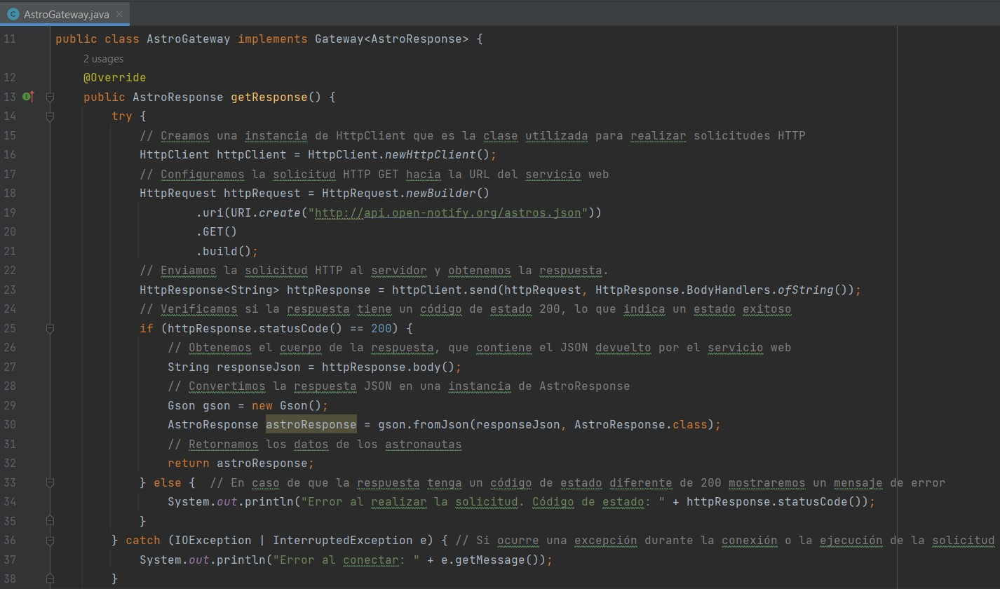

# ExamenSustitutorio-3S2

## Pregunta 2

### Explica los resultados del archivo .json

En los resultados tenemos informacion sobre astronautas en el espacio, se tiene un campo "message" 
que indica el resultado del servicio web, que en este caso es "success" lo que significa que la 
solicitud fue exitosa y los datos se obtuvieron de forma correcta. Luego tenemos "people" que es un campo 
que contiene un arreglo de objetos JSON, cada objeto representa un astronauta en el espacio y cada 
objeto contiene dos campos, name que es el nombre del astronauta y craft que es el nombre de la nave 
en la que se encuentra el astronauta. Por ultimo tenemos "number" que indica el numero total de astronautas 
que se encuentran en el espacio, en este caso es 10, por lo que habrian 10 astronautas en el espacio.

Creamos las clases basicas

Clase Assignment, que representa el nombre del astronauta y la estacion espacial:

Clase AstroResponse, que nos va a mostrar el numero de personas en el espacio, un mensaje de exito 
y el arreglo o lista de personas de las asignaciones:

Ahora usaremos el patron de diseño Gateway para acceder al servicio web RESTful.

Crearemos la interfaz Gateway:

Y tambien creamos la clase AstroGateway usando la API HttpClient

Tambien debemos definir la clase AstroService, la cual tiene como funcion convertir los registros 
devueltos por el gateway en un mapa de java.

Se explica su funcionamiento en los comentarios de codigo que se muestran a continuacion:

Teniendo todo esto configuramos el main:

Imprime la cantidad de astronautas por nave y tambien el formato JSON con los datos para verificar:

