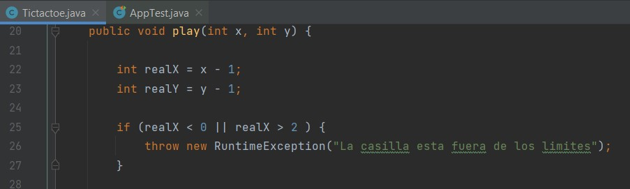
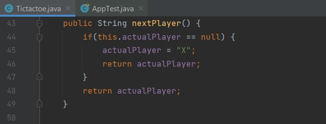
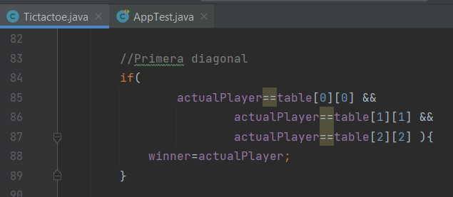
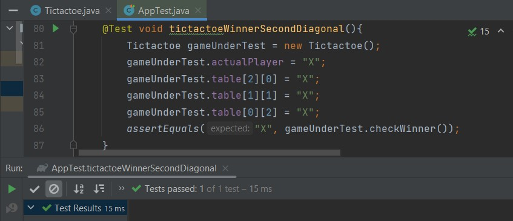
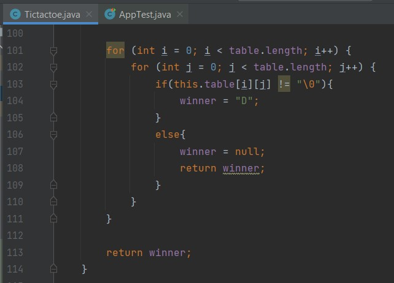

# ExamenSustitutorio-3S2

## Pregunta 1

### Requisito 1: colocación de piezas

Se definen los limites y lo que constituye una colocacion no valida de una pieza. Se puede
colocar una pieza en cualquier espacio vacío de un tablero de 3×3.

Dividiremos el requisito en 3 pruebas.

### Prueba - limites del tablero I

Cuando una pieza se coloca en cualquier lugar fuera del eje x, se lanza RuntimeException, en esta prueba,
estamos definiendo que se espera RuntimeException cuando se invoca el método ticTacToe.jugar(5, 2).

Ejecutamos esta prueba 3 veces, la primera vez, debería fallar porque el método jugar no existe. Una vez que se agrega,
debería fallar porque no se lanza RuntimeException. La tercera vez, debería tener éxito porque el
código que corresponde a esta prueba está completamente implementado.

Primera vez falla porque el metodo jugar no existe:


Ahora para la segunda vez debe fallar porque no se lanza RuntimeException:


Para la tercera vez debe tener exito, ya que en esta parte se ha implementado el codigo 
correspondiente a la prueba:



Ejecutamos la prueba y pasa correctamente:


### Prueba - limites del tablero II

Ahora debemos validar el eje y

Primero hacemos la prueba donde falla:


Luego implementamos la validacion para y:


Ejecutamos la prueba y vemos que pasa correctamente:


### Prueba - lugar ocupado

Ahora debemos asegurarnos de que solo se puedan colocar piezas en espacios desocupados.

Siguiendo el proceso rojo - verde, mostraremos primero cuando no pasa la prueba.


Ahora implementaremos el metodo para que pase la prueba.


Ejecutamos la prueba y comprobamos que ha pasado correctamente:


### Refactorizacion

Refactorizaremos moviendo el codigo a metodos separados, se crearon los metodos checkIfOutTable 
y checkIfEmpty a comparacion del codigo anterior que todo estaba en el metodo play.


### Requisito 2

Agregar soporte para dos jugadores. Dividiremos el requisito en 3 pruebas.

### Prueba - X juega primero

Como el método aun no existe:


Implementamos el metodo:



Y ahora ejecutamos la prueba y podemos ver que pasa correctamente:


### Prueba: O juega justo despues de X

Ahora haremos la prueba para asegurarnos que los jugadores estan cambiando.Después de que X haya
terminado, debería ser el turno de O, luego nuevamente X, y así sucesivamente.
Si el último turno fue jugado por X, entonces el próximo turno debe ser jugado por O.

Hacemos la primera prueba la cual debe fallar:


Ahora implementamos el metodo para que pase la prueba:


Ejecutamos la prueba y observamos que pasa correctamente:


### Prueba: X juega justo despues de O

Hacemos la primera prueba la cual debe fallar:


Ahora implementamos el metodo para que pase la prueba:


Ejecutamos la prueba y podemos observar que pasa correctamente:


Refactorizamos para almacenar jugador:


### Requisito 3: agregar condiciones ganadoras

Un jugador gana al ser el primero en conectar una línea de piezas amigas de un lado o esquina del
tablero al otro.
Para verificar si una línea de piezas amigas está conectada, debes verificar las líneas horizontales,
verticales y diagonales.

### Prueba: por defecto no hay ganador 

Si no se cumple ningunacondición ganadora, entonces no hay ganador. 

Como aun no tenemos el metodo implementado: 


Ahora implementamos el metodo:


Ejecutamos la prueba y vemos que pasa correctamente:


### Prueba - condicion ganadora I

El jugador gana cuando toda la línea horizontal está ocupada por sus piezas. 

Hacemos la primera prueba la cual falla:


Ahora implementamos el metodo para que pase la prueba:


Ejecutamos la prueba y vemos que pasa correctamente:


Refactorizamos:


### Prueba - condicion ganadora II

El jugador gana cuando toda la línea vertical está ocupada por sus piezas.

Hacemos la primera prueba que falla:


Implementamos el metodo


Ejecutamos la prueba y vemos que pasa correctamente:


### Prueba - condicion ganadora III

El jugador gana cuando toda la línea diagonal desde la parte superior izquierda hasta la parte inferior
derecha está ocupada por sus piezas.



Ahora ejecutamos la prueba y vemos que pasa correctamente:


### Prueba - condicion ganadora IV

El jugador gana cuando toda la línea diagonal desde la parte inferior izquierda hasta la parte superior derecha está ocupada por sus
piezas.

Hacemos la primera prueba la cual debe fallar:


Implementamos el metodo:


Ejecutamos la prueba y vemos que pasa correctamente:



### Requisito 4: condiciones de empate

El resultado es un empate cuando se llenan todas las casillas.

### Prueba: manejo de una situación de empate

Primero hacemos la primera prueba que debe fallar:


Implementamos el metodo:



Ejecutamos la prueba y vemos que pasa correctamente:


### Coberturas de codigo

¿Las pruebas cubrieron todos los casos? 


### Implementando una IA

Implementaremos una especie de IA que jugaría los turnos de O.

Main:

```java
import java.util.Random;
import java.util.Scanner;

public class Main {
	public static void main(String[] args) {
		Tictactoe game = new Tictactoe();
		Scanner input = new Scanner(System.in);
		Random ia = new Random();

		while(game.winner  ==  null){
			game.nextPlayer();
			if(game.actualPlayer == "X"){
				System.out.println("--------------------------------------");
				game.printTable();
				RuntimeException error;
				do{
					error = null;
					System.out.print("Ingrese fila: ");
					int x = input.nextInt();
					System.out.print("Ingrese columna: ");
					int y = input.nextInt();
					try{
						game.play(x, y);
					}catch(RuntimeException e){
						error =e;

						System.out.println("Ingrese numeros validos!");
					}
				}while(error != null);
				
				game.checkWinner();
			}
			else if(game.actualPlayer == "O"){
				RuntimeException error;
				do{
					error = null;
					int x = ia.nextInt(3);
					int y = ia.nextInt(3);
					try{
						game.play(x+1, y+1);
					}catch(RuntimeException e){
						error =e;
					}
				}while(error != null);
				
				game.checkWinner();
			}
		}

		System.out.println("Gana " + game.winner + "!");

		input.close();
	}
}
```

TicTacToe:

```java
public class Tictactoe {

	//Definicion del tablero
	public String[][] table = {
		{"\0", "\0", "\0"},
		{"\0", "\0", "\0"},
		{"\0", "\0", "\0"},
	};
	public String actualPlayer;
	public String winner;

	Tictactoe(){
	}
	public void play(int x, int y) {

		int realX = x-1;
		int realY = y-1;
		
		checkIfOutTable(realX, realY);
		checkIfEmpty(realX, realY);

		this.table[realX][realY] = actualPlayer;
	}

	public void checkIfOutTable(int x, int y){
		if(x< 0 || x > 2 || y < 0 || y > 2){
			throw new RuntimeException("La casilla esta fuera de los limites");
		}
	}

	public void checkIfEmpty(int x, int y){
		if(this.table[x][y] != "\0"){
			throw new RuntimeException("La casilla esta llena");
		}
	}

	public String nextPlayer() {
		if(this.actualPlayer == null){
			actualPlayer = "X";
			return actualPlayer;
		}
		switch (this.actualPlayer) {
			case "X":
				actualPlayer = "O";
				break;
			
			case "O":
				actualPlayer = "X";
				break;
		}
		return actualPlayer;
	}

	public String checkWinner(){
		//revision de las filas
		for (int i = 0; i < table.length; i++) {

			if(this.table[i][0]== this.table[i][1] && 
				this.table[i][1]== this.table[i][2]&& 
				this.table[i][0] != "\0"){
				winner = this.table[i][0];
				return winner;
			}
		}

		//revision de columnas
		for (int i = 0; i < table.length; i++) {

			if(this.table[0][i]== this.table[1][i] && 
				this.table[1][i]== this.table[2][i] && 
				this.table[0][i] != "\0"){
				winner = this.table[0][i];
				return winner;
			}
		}

		//diagonal superior
		if(this.table[0][0] == this.table[1][1] &&
			this.table[2][2] == this.table[1][1]&& 
			this.table[0][0] != "\0"
		){
			winner  = this.table[1][1];
			return winner;
		}

		if(this.table[0][2] == this.table[1][1] &&
			this.table[2][0] == this.table[1][1]&& 
			this.table[0][2] != "\0"
		){
			winner  = this.table[1][1];
			return winner;
		}

		for (int i = 0; i < table.length; i++) {
			for (int j = 0; j < table.length; j++) {
				if(this.table[i][j] != "\0"){
					winner = "D";
				}
				else{
					winner = null;
					return winner;
				}
			}
		}

		return winner;
	}

	public void printTable(){
		for (int i = 0; i < table.length; i++) {
			for (int j = 0; j < table.length; j++) {
				if(this.table[i][j] == "\0"){
					System.out.print("\t");
					continue;
				}
				System.out.print(this.table[i][j] + "\t");
			}
			System.out.println();
		}
	}
}
```
### Ejecutamos y probamos que funciona:


## Pregunta 2

### Explica los resultados del archivo .json

En los resultados tenemos informacion sobre astronautas en el espacio, se tiene un campo "message" 
que indica el resultado del servicio web, que en este caso es "success" lo que significa que la 
solicitud fue exitosa y los datos se obtuvieron de forma correcta. Luego tenemos "people" que es un campo 
que contiene un arreglo de objetos JSON, cada objeto representa un astronauta en el espacio y cada 
objeto contiene dos campos, name que es el nombre del astronauta y craft que es el nombre de la nave 
en la que se encuentra el astronauta. Por ultimo tenemos "number" que indica el numero total de astronautas 
que se encuentran en el espacio, en este caso es 10, por lo que habrian 10 astronautas en el espacio.

Creamos las clases basicas

Clase Assignment, que representa el nombre del astronauta y la estacion espacial:


Clase AstroResponse, que nos va a mostrar el numero de personas en el espacio, un mensaje de exito 
y el arreglo o lista de personas de las asignaciones:


Ahora usaremos el patron de diseño Gateway para acceder al servicio web RESTful.

Crearemos la interfaz Gateway:


Y tambien creamos la clase AstroGateway usando la API HttpClient


Tambien debemos definir la clase AstroService, la cual tiene como funcion convertir los registros 
devueltos por el gateway en un mapa de java.

Se explica su funcionamiento en los comentarios de codigo que se muestran a continuacion:


Teniendo todo esto configuramos el main:


Imprime la cantidad de astronautas por nave y tambien el formato JSON con los datos para verificar:


